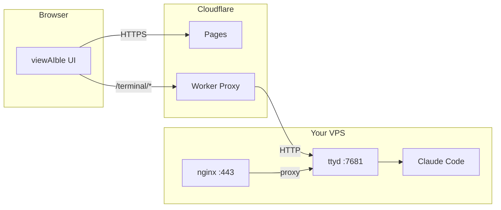
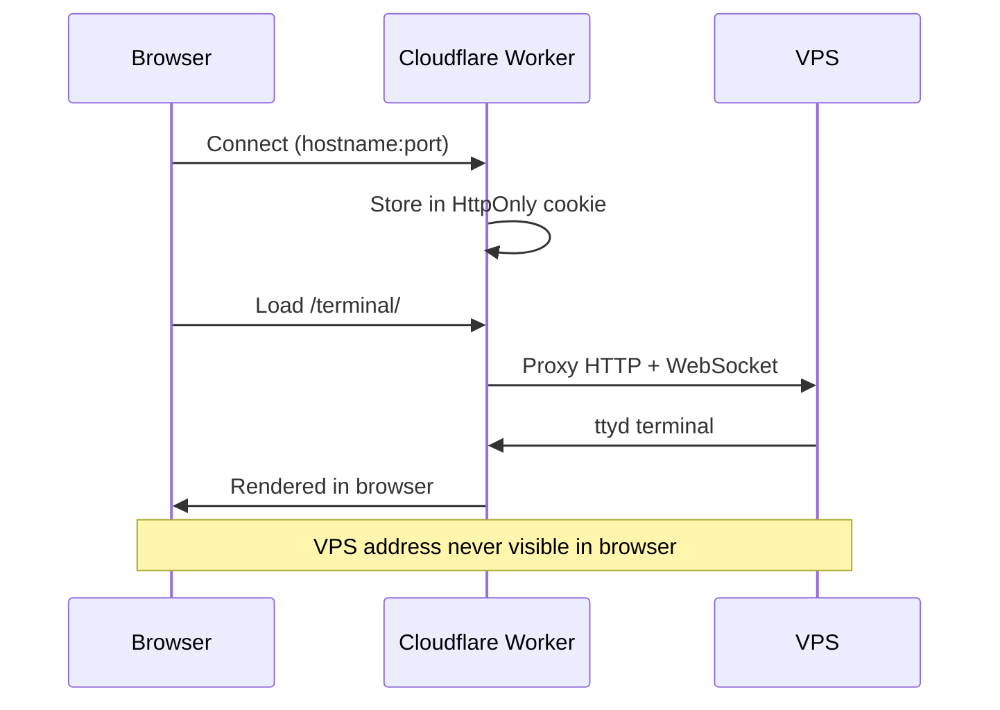

# viewAIble

**Divide and conquer, anywhere.**

Run Claude Code on any VPS directly from your browser. Multi-session terminals, zero installs, free and self-hosted.

---

## Architecture





---

## Quick Start

### 1. Deploy the App

```bash
git clone https://github.com/yourusername/viewaible.git
cd viewaible
cp site.example.yaml site.yaml  # Edit with your details
npm install
./deploy.sh
```

### 2. Set Up Your VPS

```bash
curl -fsSL https://yourdomain.com/setup.sh | bash
```

The script:
- Installs Node.js 22, Claude Code CLI, ttyd, nginx, UFW
- Generates a random auth password (displayed once — save it)
- Locks port 7681 to Cloudflare IPs only
- Auto-detects your Linux distro

### 3. Connect

1. Add a **DNS-only** (grey cloud) A record in Cloudflare pointing to your VPS
2. Open your viewAIble instance
3. Enter hostname + port (default 7681)
4. Browser prompts for ttyd credentials
5. Type `/login` in the terminal to authenticate Claude

---

## Security

| Layer | Protection |
|-------|-----------|
| UFW | Port 7681 locked to Cloudflare IPs + localhost |
| ttyd | Basic auth required (random password generated at setup) |
| Proxy | VPS address in HttpOnly cookie, never in browser/source/devtools |
| Claude | Separate OAuth login required |

---

## Features

- Up to 4 Claude Code sessions per VPS
- Smart layout: side-by-side, T-shape, 2x2 grid
- Dark / light / auto theme
- 9 terminal color presets + custom colors
- Collapsible sidebar, FAQ overlay
- All settings persist in localStorage

## Supported Distros

Debian/Ubuntu, RHEL/CentOS/Fedora/Rocky/Alma, Arch/Manjaro, Alpine, openSUSE/SLES

Add your own in `src/distros/index.js`.

---

## Configuration

Copy `site.example.yaml` to `site.yaml`:

```yaml
name: "viewAIble"
tagline: "divide and conquer, anywhere"
url: "https://yourdomain.com"
cloudflare_account_id: "YOUR_ACCOUNT_ID"
```

---

## License

MIT
